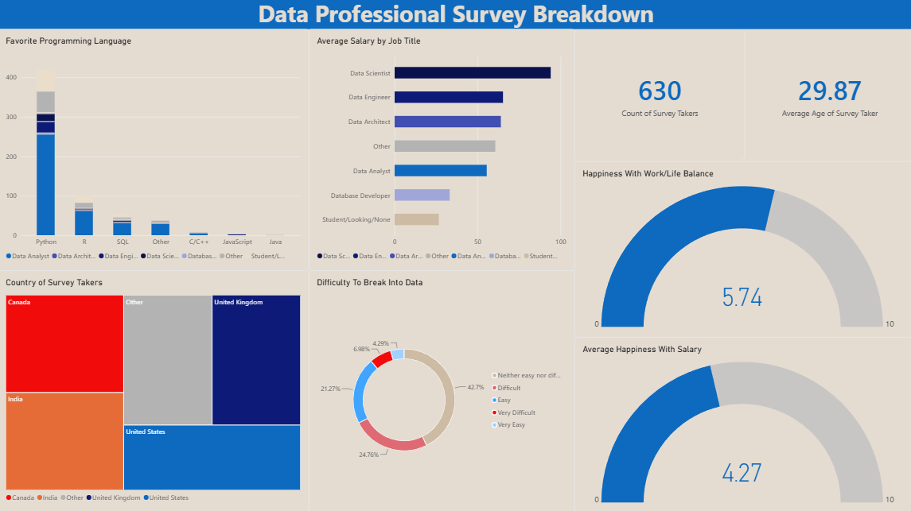

# 📊 Data Professional Survey Breakdown

An interactive dashboard built in Power BI, presenting a comprehensive analysis of survey data collected from data professionals. The project combines data transformation, modeling, and the visualization of key career, salary, and satisfaction metrics.

## 🚀 About the Project & Tools
* **Tools Used:** Power BI Desktop, Power Query.
* **Data Scope:** The analysis covers job roles, preferred programming languages, salary ranges, barriers to entering the data field, and satisfaction indicators (work-life balance and salary satisfaction).

## 📈 Key Insights & Findings from the Dashboard

* **Programming Language Dominance:** 
  * **Python** is by far the most popular language among surveyed professionals, holding a massive lead over other technologies.
  * **R and SQL** follow behind, serving as foundational tools for data analysts and engineers.

* **Salary Structure by Job Title:**
  * Highest average salaries are generated by **Data Scientist** and **Data Engineer** roles, while entry-level individuals or those currently looking for work (`Student/Looking/None`) sit naturally at the lower end of the financial spectrum.

* **Participant Geography:**
  * The majority of respondents come from Canada, the United States, and the United Kingdom, with Canada and the USA generating the largest visual share in the regional breakdown.

* **Barrier to Entry:**
  * Most respondents rate the difficulty of breaking into the data field as moderate or easy (`Easy` / `Neither easy nor difficult`), though a significant group highlights challenges (`Difficult` / `Very Difficult`), reflecting market competitiveness.

* **Job & Financial Satisfaction:**
  * The average work-life balance satisfaction score sits at **5.74 / 10**.
  * Average salary satisfaction is slightly lower at **4.27 / 10**, suggesting professionals often expect better financial compensation relative to their workload.

## 🖥️ Dashboard Preview

## ℹ️ Data Source
This project is based on survey data and tutorial materials provided by **Alex The Analyst**.
